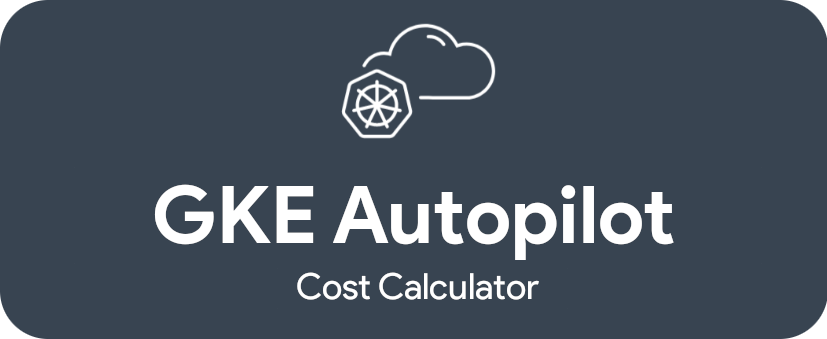
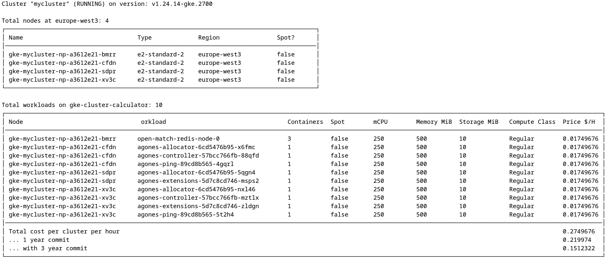

***
 

APCostCalculator is a tool that gives you an estimate on how much your workloads will cost in [GKE Autopilot mode](https://cloud.google.com/kubernetes-engine/docs/concepts/autopilot-overview). 

To obtain an estimate, you need to be have your workloads already running on a GKE cluster in Standard mode of operation, or on a compatible self-managed Kuberentes cluster (with k8s.io/metrics). APCostCalculator connects to your existing cluster and takes a snapshot of the consumed resources at that point in time (cpu / memory / ephemeral storage) and maps it to the current GKE Autopilot pricing. Consumption is calculated based on the resource requests plus what is being used on top of that and rounds it up to the closest possible value (for cpu 250mCPU increments and for memory either leaving as is or making it 1:_ratio_).

This gives an output table and can also export the results into a JSON file. JSON file can later be imported into any analytical tool (eg. BigQuery) to better understand cost variations based on workload utilization.

**Accuracy**: Shown prices are an estimation! Since GKE Autopilot has multiple compute classes (general-purpose, balanced, scale-out, performance and accelerator backed) with multiple vendors types (AMD, Intel) and different architectures (amd64 and arm64), some assumptions had to be made in the calculation logic. Having that in mind, the estimation should be relatively close to reality. This tool doesn't yet support workloads with TPUs, so if you have any, it will not be reflected in the price.

### Sample output looks like the following:

### Building

Building APCostCalculator is a straigh-forward process. You need [Go compiler](https://go.dev/doc/install). Having that in place, just run `go build` command and a binary file should be created.

### Testing

To execute the tests, just run `go test` command.

### Useage

Before you start, make sure you have [gcloud CLI](https://cloud.google.com/sdk/docs/install) installed on the machine where you are planning to execute APCostCalculator.

Enable Cloud Billing API on your project: https://console.cloud.google.com/apis/api/cloudbilling.googleapis.com/metrics?project=PROJECT_NAME

The easiest way to use the tool is to authenticate via ` gcloud auth application-default login` with the account containing the right permissions. Then get the credentials for the GKE cluster by running the following command: `gcloud container clusters get-credentials CLUSTER_NAME --zone ZONE --project PROJECT_NAME`.

Now the application should be able connect to your GKE cluster and provide a price estimate.

JSON output is also possible by using a `-json` flag. If you wish to output JSON to a file, add `-json-file=...` argument.

### Pricing for GKE Autopilot

For information about pricing for GKE Autopilot, see https://cloud.google.com/kubernetes-engine/pricing.
